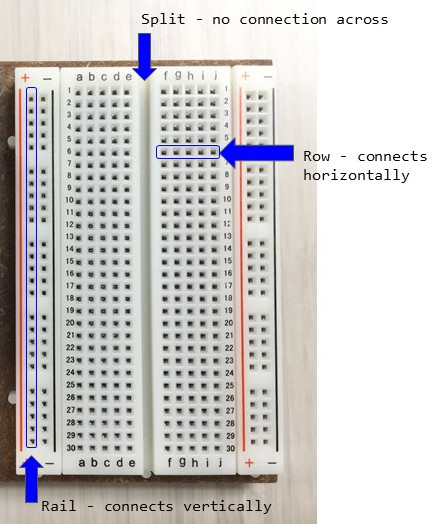

# Introducing Arduino UNO 

Meet your *microcontroller*!

[Arduino UNO](https://www.arduino.cc/en/Main/ArduinoBoardUno) is an easy to use prototyping board based on **open-source** hardware and software. It can be programmed using Arduino's basic [language](https://www.arduino.cc/en/Reference/HomePage) to create interactive physical computing projects. 

> "Arduino was born at the Ivrea Interaction Design Institute as an easy tool for fast prototyping, aimed at students without a background in electronics and programming. " -- Learn more from the [Arduino Guide](https://www.arduino.cc/en/Guide/Introduction)

For examples and inspiration check out the [Project Hub](https://create.arduino.cc/projecthub).

# Breadboard 

That white thing attached to your UNO? Its a solderless breadboard!

Breadboard make it easy to create circuits without soldering any wires together. 
The connection is made by inserting wire into the tiny holes: 

- Each pin hole on a `Rail` is connected vertically.
- Each pin hole in a `Row` is connected horizontally. 
- A `Split` runs down the middle dividing the board in two.

# Learn

1. Make it [Blink](4-code)!
2. Make it [Buzz](5-buzz)!

# More Information

[The MILL](http://mill.lib.uidaho.edu/) provides everything you need for this Arduino project.

These are the materials used:

- Arduino UNO and usb cable.
- a few basic electronic components, as found in most Arduino [starter kits](https://store.arduino.cc/usa/arduino-starter-kit): a breadboard, some jumper wires, a piezo, a 10k ohm resistor, a few 220 or 330 ohm resistors, a photoresistor, and a few LEDs.
- [Arduino Software IDE](https://www.arduino.cc/en/Main/Software) installed on your computer. Arduino IDE is a [free](https://www.gnu.org/philosophy/free-sw.en.html) and open-source software. Detailed installation instructions are available for [Linux](https://www.arduino.cc/en/Guide/Linux), [Windows](https://www.arduino.cc/en/Guide/Windows), and [Mac](https://www.arduino.cc/en/Guide/MacOSX). Alternatively, sign up for an online IDE service such as [Arduino Web Editor](https://create.arduino.cc/editor) (note: if you use Chrome OS it will be necessary to use an online editor).